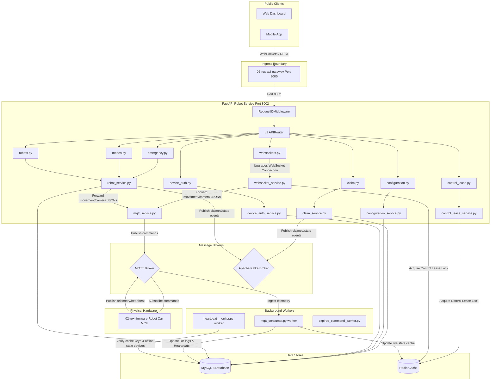

# 🤖 REX-47 Robot Service Gateway (v1.0.0)

> **Repository `07`** · Core FastAPI microservice managing physical robot registrations, device authentication, permanent user claims, control leases, real-time command routing, and safety states. Integrates with MySQL 8 (via SQLAlchemy), Redis for state locks, aiomqtt for hardware communications, and aiokafka for event broadcasting.

[]()
[]()
[]()
[]()
[]()

---

## 🧭 System Architecture

The robot service handles command transformations, checking ownership claims and control leases before broadcasting packets to physical robots and logging telemetries:



---

## 📦 Project Structure

```
07-rex-robot-service/
├── app/
│   ├── main.py               # Application factory mounter & lifecycle handlers
│   ├── config/               # Settings & driver initializers
│   │   ├── database.py       # SQLAlchemy MySQL engine connection setup
│   │   ├── kafka.py          # Kafka producer connection configurations
│   │   ├── mqtt.py           # Async MQTT connection parameters
│   │   ├── redis.py          # Redis connection initialization
│   │   └── settings.py       # Pydantic Settings environment variables schema
│   ├── middleware/           # FastAPI interceptors
│   │   ├── error_handler.py  # Global Express-like exception parser
│   │   └── request_id.py     # Request UUID trace injector
│   ├── models/               # SQLAlchemy ORM database models
│   │   ├── robot.py          # ID, serial, status, state parameters
│   │   ├── robot_configuration.py # Speed limits, angles, and threshold bounds
│   │   ├── device_session.py # Robot hardware active sessions
│   │   ├── robot_command.py  # Historical command execution audits logs
│   │   └── robot_event.py    # Robot reported alerts & warnings logs
│   ├── routes/               # FastAPI routing endpoints
│   │   ├── claim.py          # Handles owner pairings and reset clean-ups
│   │   ├── configuration.py  # Configures speed boundaries & PID presets
│   │   ├── control_lease.py  # Manages virtual joystick control leases
│   │   ├── device_auth.py    # Device registration & device JWT auth tokens
│   │   ├── emergency.py      # Estops logic controls & status releases
│   │   ├── events.py         # Queries robot event logs
│   │   ├── health.py         # Metrics & liveness health check endpoints
│   │   ├── modes.py          # Configures autonomy patrol routes & schedulers
│   │   ├── robots.py         # CRUD operations for robot instances
│   │   └── websockets.py     # High-rate WebSocket control gateways
│   ├── schemas/              # Pydantic validation schemas
│   │   ├── claim.py          # Claim input parameters schemas
│   │   ├── configuration.py  # Configuration details validators
│   │   ├── control_lease.py  # Lease allocations validators
│   │   ├── device_auth.py    # Registration parameters schemas
│   │   ├── robot.py          # Robot base schemas
│   │   └── robot_command.py  # Command structures schemas
│   ├── services/             # Core business service logic
│   │   ├── claim_service.py  # Validates serial secrets & user bindings
│   │   ├── command_service.py# Stores historical command audits
│   │   ├── configuration_service.py # Updates configuration profiles
│   │   ├── control_lease_service.py # Evaluates locks on Redis
│   │   ├── device_auth_service.py   # Authenticates robot & generates JWTs
│   │   ├── heartbeat_service.py     # Updates active heartbeat stamps
│   │   ├── kafka_service.py  # Publishes events to Kafka brokers
│   │   ├── mqtt_service.py   # Asynchronous publisher forwarding messages
│   │   ├── robot_service.py  # Robot query and state modifiers logic
│   │   └── websocket_service.py # Tracks active client websocket connections
│   ├── utils/                # Utilities and tools
│   └── workers/              # Asynchronous loops background tasks
│       ├── expired_command_worker.py # Database logs cleanup loops
│       ├── heartbeat_monitor.py      # Detects offline robots
│       └── mqtt_consumer.py          # Subscribes to telemetry topics
├── migrations/               # Alembic database schema migrations
├── tests/                    # Pytest framework automation testing
├── Dockerfile                # Production multi-stage build script
├── docker-compose.yml        # Development dependency compose setup
├── Makefile                  # Short-hands scripts
├── Jenkinsfile               # Continuous delivery pipeline configuration
├── alembic.ini               # Alembic CLI database connector configuration
├── requirements.txt          # Production package requirements
├── requirements-dev.txt      # Development package requirements
├── pyproject.toml            # Python linters configurations (Ruff, MyPy)
└── README.md                 # This file
```

---

## 🔐 Robot Ownership & Control Leases

### 1. Robot Claims
* **Claim Endpoint**: `POST /api/v1/robots/claim`
* Users claim ownership of a physical robot by presenting the `robot_secret` generated on device registration.
* To prevent brute-force attacks on serial keys and secrets, claiming endpoints are heavily rate-limited in Redis and return generic errors.

### 2. Control Leases
To prevent conflicts when multiple users are logged in (e.g. multiple clients sending competing joystick commands at the same time), the gateway implements a **Control Lease Lock** in Redis:
* A client must acquire the control lease via `POST /api/v1/robots/{robot_id}/lease`.
* The lease is granted to a single user session for **10 seconds** and must be refreshed via keep-alive requests.
* Any locomotion or joint command sent via WebSocket is validated against the active Redis lease key. Commands from non-lease holders are discarded.

---

## 🔌 WebSockets & Real-Time Command Routing

The high-rate WebSocket control endpoints are configured under [websockets.py](app/routes/websockets.py):
* **Base locomotion**: `/api/v1/ws/robots/{robot_id}/control?token=<jwt>`
* **Robotic arm joints**: `/api/v1/ws/robots/{robot_id}/arm?token=<jwt>`

### 1. Base Locomotion Commands (JSON over WS)
```json
{
  "type": "BASE_JOYSTICK",
  "sequence": 1024,
  "x": 0.35,
  "y": 0.85,
  "speed_limit": 80,
  "timestamp": "2026-07-16T12:00:00.123Z"
}
```
* **Processing logic**: The handler extracts the sequence number. If a message arrives with a sequence number lower than the last processed sequence, it is discarded to prevent out-of-order execution. The X/Y vectors are mapped to the robot's physical constraints before being routed downstream.

### 2. Camera Pan-Tilt / Arm Commands (JSON over WS)
```json
{
  "type": "ARM_POSE",
  "joints": {
    "base": 90,
    "shoulder": 120,
    "elbow": 60,
    "grip": 90
  },
  "speed": 50,
  "sequence": 2048
}
```
* Custom parameters are forwarded directly to the robot's PCA9685 driver via the MQTT broker.

---

## 📡 MQTT Topic Map

The Robot Service acts as an intermediary, translating WebSockets streams into MQTT publishes and subscribing to hardware status updates:

### Commands (Outward: Service -> Robot)
* `rex/robots/{robot_id}/commands/base` — Raw mobility vectors.
* `rex/robots/{robot_id}/commands/arm` — Joint angles payload.
* `rex/robots/{robot_id}/commands/mode` — Patrol, manual, autonomous, or line-following directives.
* `rex/robots/{robot_id}/commands/config` — Changes settings on the fly.
* `rex/robots/{robot_id}/commands/emergency-stop` — Triggers immediate motor cut-offs (QoS 1).

### Status (Inward: Robot -> Service)
* `rex/robots/{robot_id}/status` — Reports system states.
* `rex/robots/{robot_id}/heartbeat` — Periodic checks (every 5 seconds) confirming connection.
* `rex/robots/{robot_id}/acknowledgements` — Confirmations of command execution.
* `rex/robots/{robot_id}/events` — Reports warnings or errors (e.g. `ERR_I2C_TIMEOUT`, `OBSTACLE_WARNING`).

---

## 🛠️ Compilation & Getting Started

### Prerequisites
* **Python**: `^3.12`
* **MySQL**: `^8.0`
* **Redis**: `^6.0`
* **MQTT Broker**: (e.g., Mosquitto, EMQX)
* **Kafka**: Port mapped and running

### Local Configurations

1. **Clone the repository**
   ```bash
   git clone https://github.com/thathsarabandara/07-rex-robot-service.git
   cd 07-rex-robot-service
   ```

2. **Setup virtual environment**
   ```bash
   python3 -m venv .venv
   source .venv/bin/activate
   ```

3. **Install dependencies**
   ```bash
   pip install -r requirements.txt
   pip install -r requirements-dev.txt
   ```

4. **Initialize configurations**
   ```bash
   cp .env.example .env
   ```
   *Edit `.env` values to define database, Redis, MQTT, and Kafka endpoints.*

5. **Apply database schemas**
   ```bash
   alembic upgrade head
   ```

6. **Start local ASGI development server**
   ```bash
   uvicorn app.main:app --reload --port 8002
   ```
   *Swagger documentation is exposed at http://localhost:8002/api/docs.*

---

## 🧪 Testing & Code Quality

Run linting, static type verification, and Pytest coverage suits:
```bash
# Lint checks using Ruff
ruff check .

# Static type verification with MyPy
mypy app

# Execute Pytest verifying code coverage is > 90%
pytest --cov=app --cov-report=term-missing --cov-fail-under=90
```

---

## 📦 Deployment & CI/CD Pipelines

### Docker Containerization
To compile the service as a containerized image:
```bash
# Build multi-stage production image
docker build -t rex-robot-service .

# Run Docker container with environment file
docker run --env-file .env -p 8002:8002 rex-robot-service
```

### Automated CI/CD
* **GitHub Actions**: Workflows verify code, spin up MySQL/Redis containers, execute Pytest suites, and publish compiled image tags to GitHub Container Registry (GHCR).
* **Jenkins**: Jenkins reads configuration pipelines defined in [Jenkinsfile](Jenkinsfile) to run lint verifications, execute tests, compile production containers, and tag/push release artifacts to GHCR using credential stores.

---

## 📈 Feature Roadmap

| Module | Feature Description | Status |
|:---:|---|:---:|
| **Robot** | Device registrations & Argon2 secret hash configurations | ✅ Implemented |
| **Claim** | User ownership claim binds & token rotations | ✅ Implemented |
| **Lease** | Redis-backed control leases locks | ✅ Implemented |
| **WS** | WebSocket control channels for base & arm movement | ✅ Implemented |
| **WS** | Discard out-of-order frames using sequence numbers | ✅ Implemented |
| **MQTT** | Asynchronous JSON command publishers | ✅ Implemented |
| **MQTT** | Asynchronous telemetry subscriber workers | ✅ Implemented |
| **Safety** | Connection loss monitor & heartbeat offline triggers | ✅ Implemented |
| **Observability**| Health endpoints ready checks & Prometheus metrics | ✅ Implemented |
| **SLAM** | WebSocket SLAM map coordinate stream tunnels | ⏳ Planned |
| **Fleet** | Multi-robot coordinated command pipelines | ⏳ Planned |

---

<div align="center">
  <sub>Part of the <strong>REX-47</strong> Autonomous Robotic Platform Ecosystem</sub>
</div>
